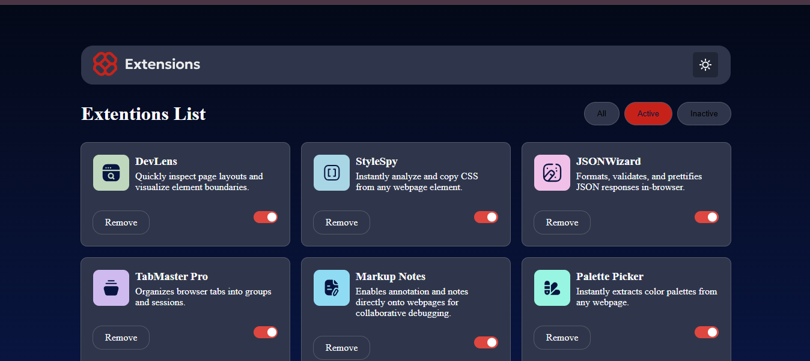
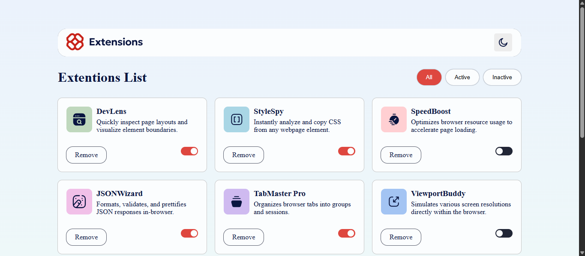
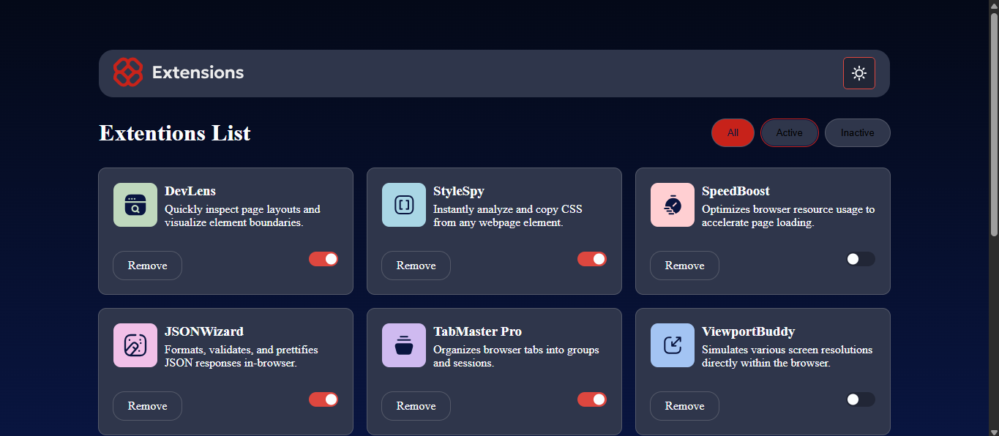
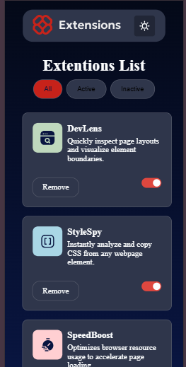

# Frontend Mentor - Browser extensions manager UI solution

This is a solution to the [Browser extensions manager UI challenge on Frontend Mentor](https://www.frontendmentor.io/challenges/browser-extension-manager-ui-yNZnOfsMAp). Frontend Mentor challenges help you improve your coding skills by building realistic projects.

## Table of contents

- [Overview](#overview)
  - [The challenge](#the-challenge)
  - [Screenshot](#screenshot)
  - [Links](#links)
- [My process](#my-process)
  - [Built with](#built-with)
  - [What I learned](#what-i-learned)
- [Author](#author)

## Overview

### The challenge

Users should be able to:

- Toggle extensions between active and inactive states
- Filter active and inactive extensions
- Remove extensions from the list
- Select their color theme
- View the optimal layout for the interface depending on their device's screen size
- See hover and focus states for all interactive elements on the page

### Screenshot

### Links

- Solution URL: [My Solution URL](https://www.frontendmentor.io/challenges/browser-extension-manager-ui-yNZnOfsMAp)
- Live Site URL: [The Live Site](https://omar-p-code.github.io/browser-extensions-manager/index.html)

## My process

### Built with

- Semantic HTML5 markup
- CSS custom properties
- Flexbox
- CSS Grid
- Mobile-first workflow
- [scss] - css preprocessor

### What I learned

I learned How TO Imporve My Written Code And Reduce His Complexity

## Author

- Website - [Omar](https://omar-p-code.github.io/my_portfolio/public/index.html)
- Frontend Mentor - [@omar-p-code](https://www.frontendmentor.io/profile/omar-p-code)

